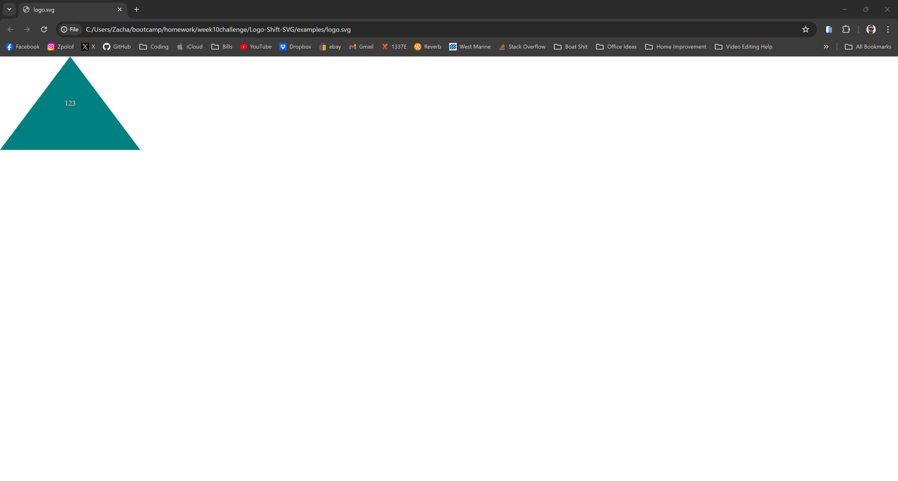
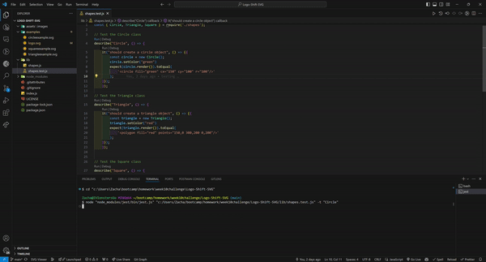

# Logo-Shift SVG Logo Maker

## Table of Contents

* [Description](#description)
* [Languages](#languages)
* [Features](#features)
* [Usage](#usage)
* [Credits](#credits)
* [License](#license)  

## Description

 SVG logo generator designed to help make a basic logo for your brand.

## Languages

* 	
* 

## Features

* **Unit testing:** Application has built in unit testing for shapes using JEST.
* **User Input:** Application will prompt user for input on questions for logo and then auto generate based on the response.
* **Shapes:** Application have a few different options for logo shape.
* **Shape / Constructor:** Uses constructors to define several shape options. 

## Usage

* npm install to load all necessary packages.
* Node index.js to start if running local.

* [Logo-Shift Demo Video](https://drive.google.com/file/d/12FP6RmWQYlsNEDP-kbuLKcVDh872gvNB/view?usp=sharing)

* [Logo-Shift-SVG](https://github.com/IVIonsters/Logo-Shift-SVG)

* 

* 

## Credits

* [N/A](N/A)

## License

